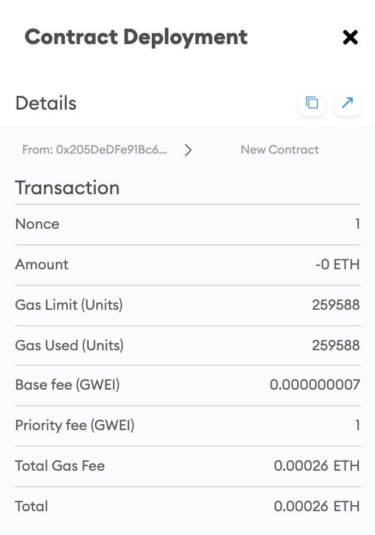
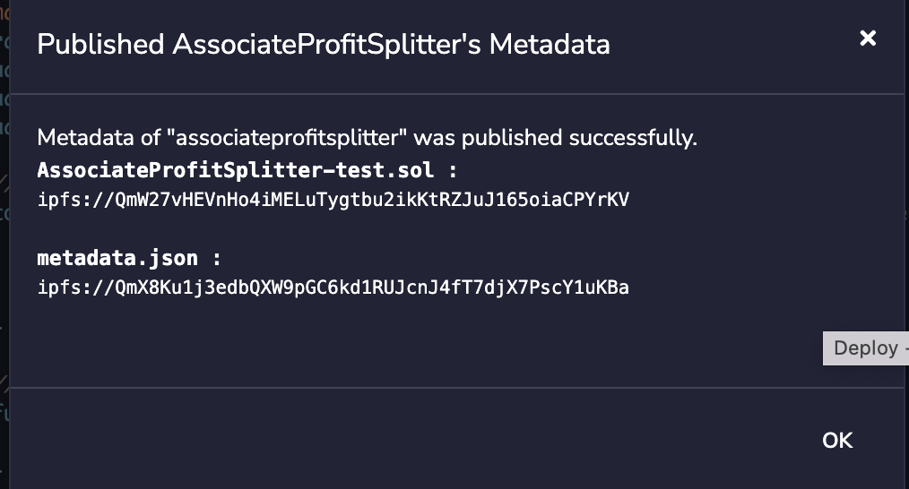
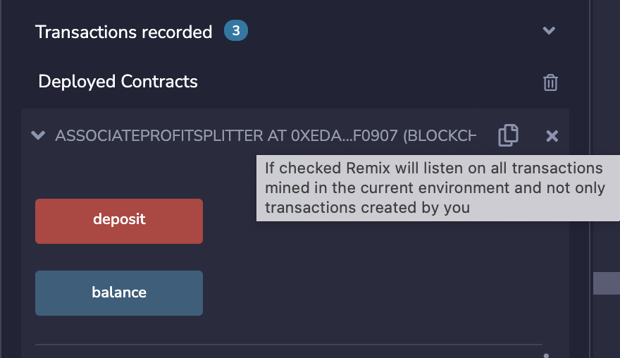
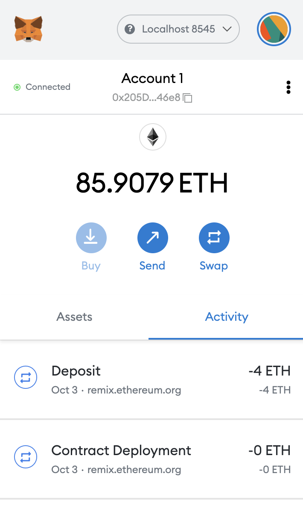
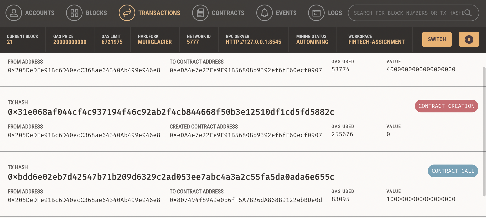
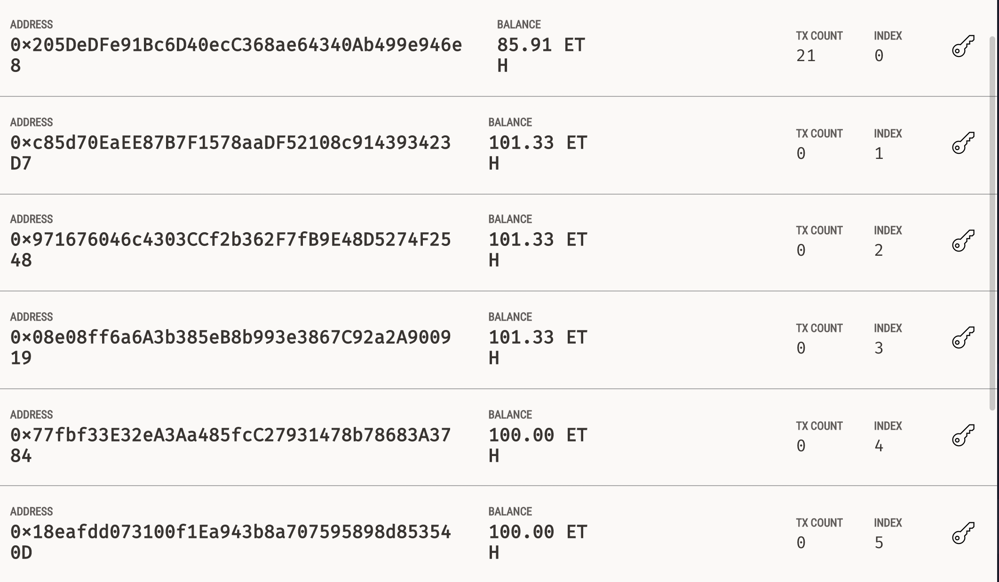
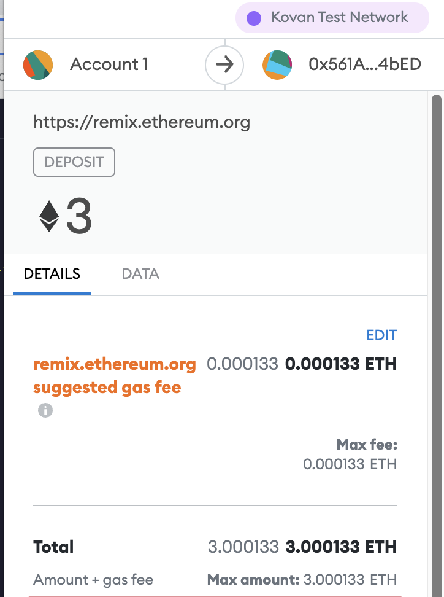
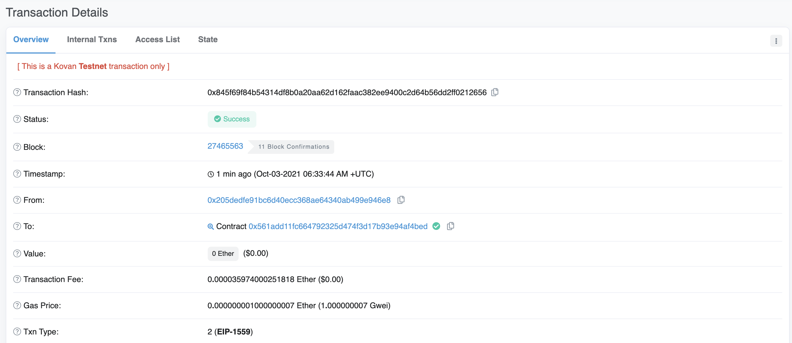

# Unit 20 - "Looks like we've made our first contract!"

This assignment is creating ProfitSplitter contracts which would perform the below 
- Pay the company's  associate-level employees quickly and easily. The solidity coding is done in AssociateProfitSplitter.sol
    This will accept ether into the contract, and divide it evenly among associate-level employees. This will allow the human resources department to pay employees quickly and efficiently.

Procedure involved is explained below 
 - From the Remix IDE and created a new contract called AssociateProfitSplitter-test.sol
 - the Ganache development chain was utilised
 - MetaMask was pointed to localhost:8545

 At the top of this contract, public variables were defined with type "address payable" and also Created a constructor which would accepts them. Then the functions are created for Balance, Deposit and fallback function to call Deposit which would perfom the transactions and also would ensure that the logic in deposit executes if ether is sent directly to the contract. In that way it prevents ether from being locked in the contract.

 ## Testing the contract

 In the Deploy tab in Remix, deployed the contract to the local Ganache chain by connecting to Injected Web3 and ensuring MetaMask is pointed to localhost:8545.
Then filled in the constructor parameters with the designated employee addresses.

<kbd>
<kbd>
<kbd>
<kbd>

Metamask with localhost - with transaction
<kbd>

The transaction details were found in the Ganache app as well.
<kbd>

<kbd>

## Deploy the contracts to a live Testnet

MetaMask was pointed to the Kovan network and then the contract was deloyed again and did the transaction from Deposit method.
<kbd>

This transaction details were found online in [kovan etherscan](https://kovan.etherscan.io/) website
<kbd>